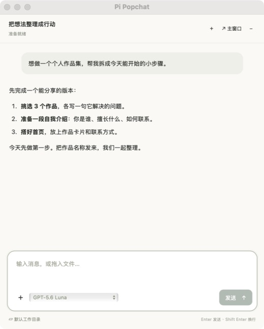
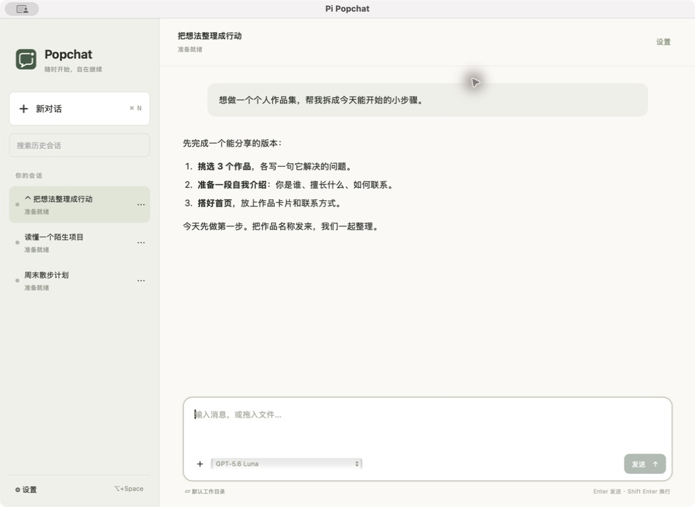

<p align="center">
  
</p>

# Pi Popchat

**按下 ⌥Space，随时开始一段 Agent 对话。**

Pi Popchat 是一款 macOS 桌面 Agent 客户端。阅读网页、查看文件或写代码时，用快捷键唤起浮窗，提问、粘贴图片、拖入文件；需要回顾或继续之前的工作，再到主窗口找到那段会话。

目前接入本机的 [Pi](https://github.com/earendil-works/pi/tree/main/packages/coding-agent)。完成首次配置后，日常对话可以直接在应用里进行，无需另开终端管理 Pi 进程。Pi Popchat 专注桌面交互，任务执行和模型访问交给 Agent。

## 随时唤起，聊完收起

<p align="center">
  
</p>

按 **⌥Space**，浮窗会出现在当前活动窗口所在的显示器上，也支持在其他应用的全屏界面上方使用。按 **Esc** 或再次按快捷键收起，任务仍可继续执行；点击浮窗外部不会自动收起。

临时的问题不必挤进同一段长对话：浮窗收起超过 **30 分钟**，且当前没有执行或等待回答的任务时，下次唤起会开启新会话。之前的内容依然保留在历史中。

## 需要的时候，接着聊



主窗口集中保存应用内创建的会话。可以搜索历史、重命名、置顶或删除，也可以从浮窗直接转到主窗口继续同一段对话。

*截图来自实际应用，使用预置示例内容，仅用于展示界面。*

## 不止文字对话

- **带上图片和文件**：用 ⌘V 粘贴图片，或将文件拖入输入区；发送前可以预览或移除附件。具体能处理什么内容，由 Agent 和所选模型决定。
- **边执行，边补充**：执行中发送的消息默认排队，也可选择“立即插入”，由 Pi 在支持的时机接收补充指令。
- **选择模型和命令**：模型列表和 `/` 命令来自 Pi。模型信息会缓存，重复打开窗口不会重复获取；配置变更后可在设置中重新检测。
- **在合适的目录工作**：默认使用应用管理的工作目录，也可自行选择。回复中的本地文件可以用 macOS 默认应用打开。
- **收起后安心等待**：关闭窗口不会退出应用，也不会停止任务。允许系统通知后，可收到任务通知并回到对应会话。

## 开始使用

### 1. 准备 Pi

按 [Pi 官方指南](https://github.com/earendil-works/pi/tree/main/packages/coding-agent#quick-start) 安装 Pi，并完成登录或模型配置。先在终端运行 `pi`，确认能正常对话。

Pi Popchat 会检测本机的 Pi；未找到时会提供安装指引，也可在设置中指定可执行文件路径。模型和登录凭证由 Pi 管理，无需在 Pi Popchat 中再配置一套。

当前兼容验证基线为 **Pi 0.84.1**，不代表所有更新版本都已经验证。

### 2. 构建并打开应用

当前提供源码构建方式，已验证环境为 **macOS 15 / Apple Silicon**。准备 Go 1.26、Node.js 24 和 Xcode Command Line Tools，在项目根目录执行：

```sh
sh scripts/build-app.sh
sh scripts/run-app.sh
```

应用位于 `dist/Pi Popchat.app`，后续也可以直接双击打开。当前构建使用本机签名，尚未公证；Intel Mac 和其他 macOS 版本暂未验证。

### 3. 开始第一段对话

按 **⌥Space**，输入问题并按 **Enter** 发送。要把截图一起交给 Agent，先复制图片，再在输入框按 **⌘V**。

需要更换快捷键、指定 Pi 路径或刷新模型信息时，打开 **设置**。若修改了 Pi 的模型配置，点击 **重新检测** 即可更新；首次连接或重连也会自动获取模型信息。

## 常用操作

| 想做什么 | 操作 |
| --- | --- |
| 唤起 / 收起浮窗 | ⌥Space，默认快捷键可在设置中修改 |
| 发送 / 换行 | Enter / Shift+Enter |
| 粘贴图片 | 在消息输入框按 ⌘V |
| 收起但继续执行 | Esc，或关闭窗口 |
| 找回历史 / 退出应用 | 菜单栏图标 → 打开主窗口 / 退出 Pi Popchat |

单个附件最大 **32 MB**，单条消息的图片合计最大 **16 MB**。停止、失败或重启后，尚未发送的队列会暂停，需要主动恢复；退出时若仍有任务运行，应用会先提示。

## 数据放在哪里？

会话索引、草稿、队列、附件和默认工作目录保存在本机：

```text
~/Library/Application Support/Pi Popchat/
```

应用只管理自己创建的会话，不接管终端中的 Pi 会话。删除历史不会递归删除自行选择的工作目录或任务产物。

Pi Popchat 不直接调用模型，也不保存模型凭证。对话由本机 Pi 交给所选模型服务处理，因此“历史保存在本机”不等于“对话内容不会离开本机”。

## 当前支持范围

目前支持 **macOS + Pi**。Codex、Claude Code 等 Agent 是后续扩展方向，尚未接入；语音输入和内置文件编辑器不在当前版本中。

遇到问题时，可记录复现步骤、macOS 与 Pi 版本，以及问题发生在主窗口还是浮窗，方便定位。

## 参与开发

项目使用 **Go + Wails v3 + React**。交互层与 Agent 适配分离，优先复用成熟 Agent 的能力。

```sh
# 前端测试、Go 行为与竞态检查、前端构建
sh scripts/test.sh

# 修改 Go 服务接口后，重新生成前端绑定
sh scripts/generate-bindings.sh
```

原生验收需先退出运行中的应用，并避免检查期间操作桌面或更改剪贴板：

```sh
sh scripts/check-desktop.sh
sh scripts/check-native-clipboard.sh
```

真实模型测试默认跳过。如需运行，它会实际使用本机 Pi 和模型配置：

```sh
PI_POPCHAT_REAL_TEST=1 go test -race ./internal/agent/pi ./internal/core -count=1 -v
```

[产品需求](docs/requirements.md) · [架构与模块](docs/implementation-plan.md) · [Pi 兼容性验证](docs/pi-compatibility-report.md) · [修复与验收记录](docs/reviews/)

## 许可证

本项目采用 [MIT License](LICENSE)。第三方依赖遵循各自的许可证。
